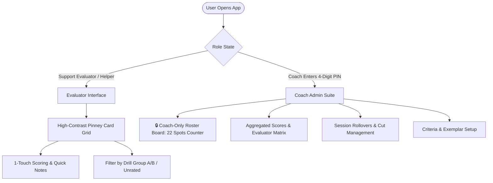

# Tryout Tracker Plan (Ignite Juniors Ultimate Frisbee)
*(React + Vite PWA + PocketBase / PocketHost.io)*

## Top-Level Overview
A lightweight, mobile-first Progressive Web App (PWA) tailored for **Ignite Juniors Ultimate Frisbee** tryouts across 3 sessions (Session 1: ~40 max players $\to$ progressive cuts down to a target 22-player roster). Coaches and sideline evaluators can rapidly grade players in real time across ~16 customizable criteria with offline caching, high-contrast pinney color cards, drill group filtering, exemplar player anchors, preset quick tags, and strict role separation:
- **Evaluators/Helpers**: Fast, focused card grid for their assigned drills, 5-point touch scoring, and notes. No access to other evaluators' scores, rosters counts, or locked statuses.
- **Coaches (PIN-Protected)**: Access to the **Coach Roster Board & Leaderboard** (target 22 count: *"14 of 22 spots locked • 8 open"*), 1-click player locking/unlocking, evaluator score breakdowns, session rollover cuts, and CSV export.

### Tech Stack & Architecture
- **Frontend**: React (Vite) + Tailwind CSS + Lucide Icons + PWA (`vite-plugin-pwa` with offline service worker).
- **Client Cache / Offline Queue**: IndexedDB (Dexie.js / Zustand Persist) for instant sub-10ms UI taps and background sync resilience on field cellular connections.
- **Backend / Realtime**: PocketBase hosted on PocketHost.io (or any PocketBase instance) providing collection APIs and realtime SSE subscriptions.
- **Access Model**: Evaluator name entry on load; 4-digit PIN for coach admin controls, roster cuts/rollover, Roster Board, and aggregate leaderboards.

---

## Role Separation & Roster Board Access

---

## Data Schema & Collections (PocketBase)

1. **`sessions` (Tryouts)**
   - `id` (text, PK)
   - `name` (text, e.g. "Session 1 - Open Tryout", "Session 2 - Callbacks", "Session 3 - Final")
   - `session_number` (number: 1, 2, 3)
   - `target_roster_size` (number, default: 22)
   - `date` (date)
   - `status` (text: `active` | `finalized`)
   - `admin_pin_hash` (text)

2. **`criteria`**
   - `id` (text, PK)
   - `session_id` (relation -> `sessions`)
   - `name` (text, e.g. "Break Throws", "Deep Defense", "Field Vision")
   - `category` (text: `Offense` | `Defense` | `Athleticism & Intangibles`)
   - `description` (text)
   - `exemplar_player_name` (text, e.g. "Kian", cached benchmark)
   - `sort_order` (number)

3. **`players`**
   - `id` (text, PK)
   - `session_id` (relation -> `sessions`)
   - `name` (text)
   - `pinney_number` (number)
   - `pinney_color` (text, hex or color name e.g. "Red", "Navy", "White")
   - `group_name` (text, e.g. "Group A", "Group B")
   - `is_locked` (bool, true if coach locked onto team - visible in Coach View)
   - `status` (text: `active` | `injured` | `absent` | `no_need_to_watch` | `cut_moved_down`)
   - `notes` (text)

4. **`evaluations`**
   - `id` (text, PK)
   - `session_id` (relation -> `sessions`)
   - `player_id` (relation -> `players`)
   - `criterion_id` (relation -> `criteria`)
   - `evaluator_name` (text)
   - `score` (number: 1..5 corresponding to `--`, `-`, `Std`, `+`, `++` / `0, 1-, 1, 2, 3+`)
   - `updated_at` (datetime)

5. **`player_notes`**
   - `id` (text, PK)
   - `session_id` (relation -> `sessions`)
   - `player_id` (relation -> `players`)
   - `evaluator_name` (text)
   - `preset_tag` (text, e.g. "Lock for team", "Cut / Move Down", "Bubble", "High motor", "Great handler")
   - `custom_text` (text)
   - `created_at` (datetime)

---

## Sub-Tasks

### Sub-Task 1: Project Scaffolding & Offline PocketBase Client Setup
- **Intent**: Initialize the Vite React TypeScript application with Tailwind CSS, PWA plugin, icons, and configure the PocketBase client wrapper with offline storage sync.
- **Expected Outcomes**:
  - Runnable React Vite app with PWA support.
  - PocketBase connection configuration (PocketHost URL configurable via `.env` or in-app setting).
  - Offline sync helper (Dexie / localStorage queue) with an online/offline sync status indicator.
- **Todo List**:
  - [ ] Initialize Vite React + TypeScript project with Tailwind CSS.
  - [ ] Install dependencies: `pocketbase`, `lucide-react`, `clsx`, `tailwind-merge`, `dexie`, `papaparse`.
  - [ ] Configure `vite-plugin-pwa` for manifest, icons, and offline caching.
  - [ ] Create `PocketBase` client provider and local queue sync service.
- **Status**: `[ ] pending`

### Sub-Task 2: Roster, Session & Criteria Administration (Admin View)
- **Intent**: Give coaches full control to manage 3 tryout sessions, carry over rosters between sessions, upload CSVs, edit pinney colors/numbers, define drill groups, and manage criteria with benchmark exemplars.
- **Expected Outcomes**:
  - PIN modal (e.g. 4-digit code) unlocking Coach Admin controls in `sessionStorage`.
  - Session manager with 1-click "Carry over advancing players to next session" (excluding cuts/moved-down players).
  - CSV parser for quick player import (`Name, Number, PinneyColor, Group`).
  - Interactive player management table (edit number, pinney color, mark Injured/Absent/No Need to Watch/Cut).
  - Criteria manager (add/edit Offense, Defense, and Intangibles criteria with short names, descriptions, and exemplar benchmark player).
  - "Finalize Tryout" toggle that freezes evaluator submissions.
- **Todo List**:
  - [ ] Build PIN-protected Admin Route / Modal.
  - [ ] Implement Session Manager (Session 1, 2, 3 + Roster Rollover functionality + Target Roster Size setting e.g. 22).
  - [ ] Implement CSV upload & validation using `papaparse`.
  - [ ] Implement manual Player Add / Edit / Status toggling.
  - [ ] Implement Criteria management panel with exemplar player support.
  - [ ] Implement "Finalize Tryout" toggle.
- **Status**: `[ ] pending`

### Sub-Task 3: Mobile Sideline Evaluator Interface (Player Grid & Filtering)
- **Intent**: Provide a high-speed, thumb-friendly mobile interface for coaches and support staff watching live field drills (evaluators only see their own ratings and designated groups; no coach aggregate roster details).
- **Expected Outcomes**:
  - Fast evaluator onboarding (enter name on first open, persisted locally).
  - High-contrast player cards showing player name, big jersey number, and vibrant pinney color matching real-life jerseys.
  - Quick filter bar: `All Players`, `Group A`, `Group B`, `Needs Evaluation`, or `My Assigned Group`.
  - Visual indicator on cards showing if the current evaluator has rated that player.
- **Todo List**:
  - [ ] Build Evaluator Name Entry prompt with local persistence.
  - [ ] Build responsive Player Grid with color-coded jersey tiles.
  - [ ] Implement filter pill bar (All, Group A, Group B, Unrated, No Need to Watch).
  - [ ] Add instant search by name or jersey number for rapid selection during game scrimmages.
- **Status**: `[ ] pending`

### Sub-Task 4: Rapid Scoring & Note Taking Sheet with Exemplars
- **Intent**: Enable evaluators to tap a player and score criteria in under 5 seconds with zero clutter, showing criterion descriptions and benchmark exemplar players.
- **Expected Outcomes**:
  - Bottom-sheet / modal scoring drawer with big tap targets for 5-level scale (`--`, `-`, `Std`, `+`, `++`).
  - Clear criterion header showing description and exemplar anchor (e.g., *"Break Throws (e.g. Kian)"*).
  - Preset quick-tag chips (*"Lock"*, *"Cut / Move Down"*, *"Bubble"*, *"High motor"*).
  - Freeform note input.
  - Instant optimistic write to local DB and background sync to PocketBase.
  - Next/Previous player navigation buttons to quickly move through a drill group without returning to the list.
- **Todo List**:
  - [ ] Build touch-friendly 5-point score selector for each criterion with exemplar badge display.
  - [ ] Build preset note tag selector + optional freeform text field.
  - [ ] Connect scoring changes to optimistic UI updates and background sync queue.
  - [ ] Implement Next / Prev player navigation buttons in the scoring view.
- **Status**: `[ ] pending`

### Sub-Task 5: Coach-Only Roster Board, Leaderboard & Aggregation Dashboard
- **Intent**: Provide head coaches with a private, PIN-locked dashboard to review aggregated ratings, compare evaluator inputs, manage the live 22-player roster board with 1-click locking/unlocking, and export selections.
- **Expected Outcomes**:
  - **Coach-Only Live Roster Board Header**: Shows total target spots (22), locked spots (e.g. 12), and available open spots (10). Hidden from non-coach evaluators.
  - **1-Click Lock/Unlock Toggle**: Directly lock or unlock a player from the coach leaderboard or player profile.
  - Aggregated Leaderboard table with sorting by Offense, Defense, and Overall ratings with bubble/cutline markers.
  - Player Detail drawer showing all evaluator notes & scores side-by-side.
  - CSV Export of all compiled scores, locked status, and notes.
- **Todo List**:
  - [ ] Build Coach-Only Live Roster Board header component with counter (*"X of 22 spots locked • Y remaining"*).
  - [ ] Implement 1-click Lock / Unlock toggle on coach leaderboard and player drawer.
  - [ ] Build Aggregated Leaderboard table with sorting by Offense, Defense, and Overall ratings.
  - [ ] Add 22-player roster cut-line visual indicator.
  - [ ] Build Player Detail drawer showing all evaluator notes & scores side-by-side.
  - [ ] Implement CSV Export of all compiled scores and notes.
- **Status**: `[ ] pending`

### Sub-Task 6: PocketBase Schema Setup & PocketHost Deployment Guide
- **Intent**: Provide the automated schema creation script / PocketBase migration and a step-by-step setup guide for deploying to PocketHost.io.
- **Expected Outcomes**:
  - PocketBase schema export (`pocketbase-schema.json`) for 1-click import into PocketHost.
  - Clear README with PocketHost deployment steps and local development instructions.
- **Todo List**:
  - [ ] Create `pocketbase-schema.json` for importing collections into PocketHost.
  - [ ] Write documentation for deploying the frontend to Vercel/Netlify/GitHub Pages and backend to PocketHost.io.
  - [ ] Test end-to-end sync, role separation, and session finalization.
- **Status**: `[ ] pending`
